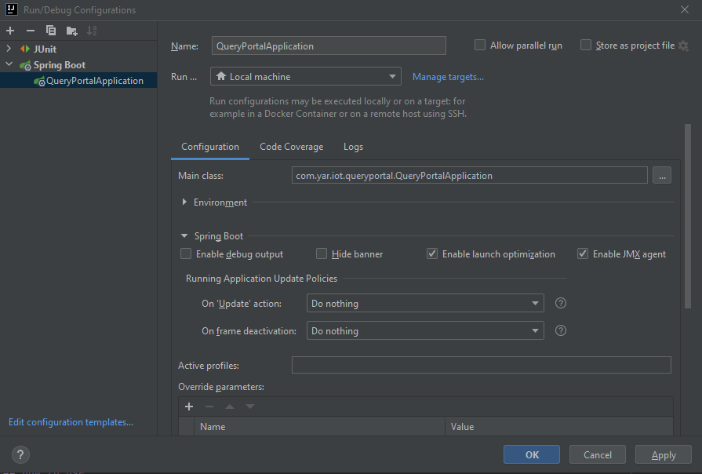
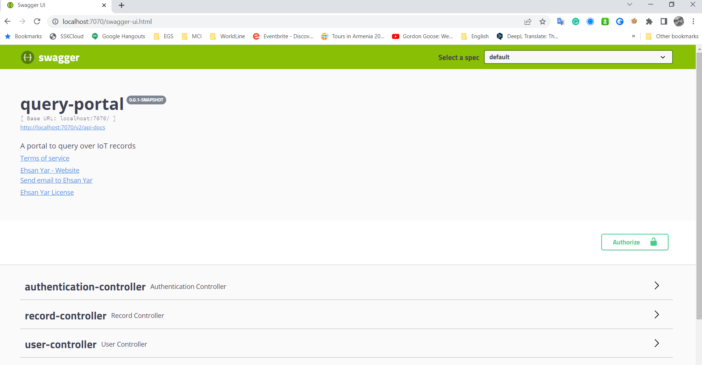
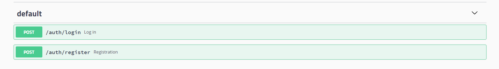
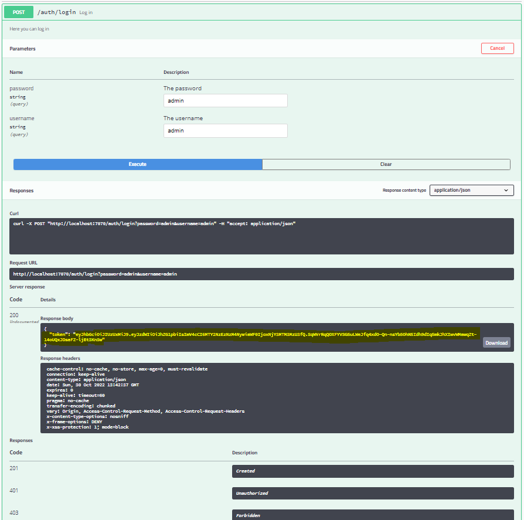
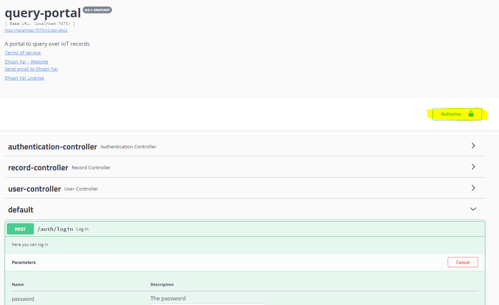
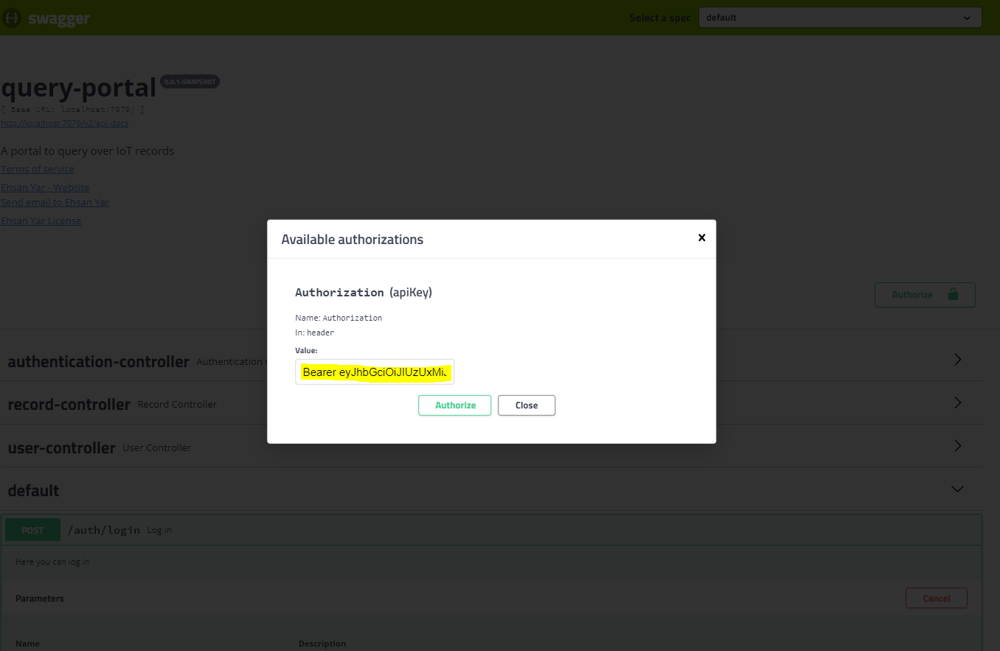
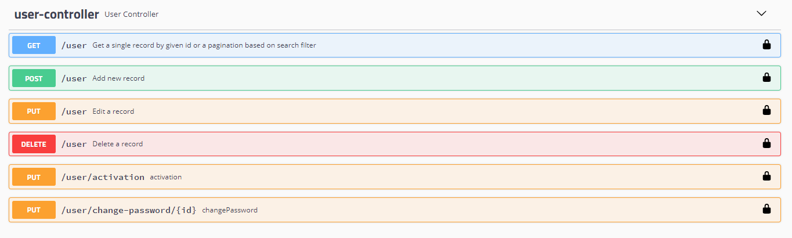
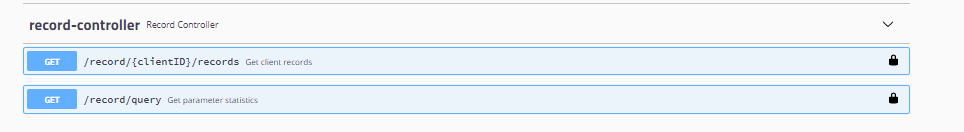

# Query Portal

## Table of contents
* [Introduction](#Introduction)
* [How to run](#How to run)
* [How to use](#How to use)

## Introduction
This application provide a secure portal as a spring boot application in case of adding and implementing the analytics API's for business requirement needs. 

## How to run
### Prerequirements:
* Java 11+
* Maven
* MongoDB

There is a docker compose file which will provide MongoDB service by running the ‘docker compose up’ command.

### IDE
  Step 1 : Run maven command:

    >> mvn clean install

  Step 2 : Run IotPipelineApplication.java
    
  

### Maven
  Run below command:

    >> mvn clean install spring-boot:run

### Dockerization
Run the 'Dockerfile'

## How to use

The default server port is 7070. for changing the port the "sever.port" config on "application.properties" should be changed.

The swagger link: http://localhost:7070/swagger-ui.html
  

There is APIs for login and registration. The default admin username and password is "admin".
  

Copy the token
  

Add the token into authorize modal for authorization and access of the other APIs with the below format.
"Bearer {token}"
  
  

Now the other APIs are accessible.

The user management APIs:
  

The IoT records APIs:
* Get a client all records: GET /record/{clientID}/records
  * Get a parameter statistics: GET /record/query
  

